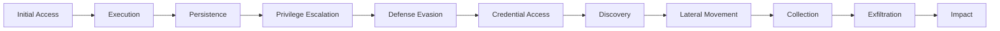

# Campaign Tracking Template

> **Campaign Status:** 🔴 Active | 🟡 Monitoring | 🟢 Concluded  
> **Last Updated:** YYYY-MM-DD  
> **Threat Level:** Critical / High / Medium / Low

## Campaign Overview

**Campaign Name:** [Operation/Campaign Name]  
**Alternative Names:** [Other names used for this campaign]  
**Campaign ID:** [Internal tracking ID]

**Start Date:** YYYY-MM-DD  
**End Date:** YYYY-MM-DD or Ongoing  
**Duration:** [X days/weeks/months]  
**Current Status:** Active / Monitoring / Concluded

---

## Executive Summary

[2-3 paragraph summary of the campaign: what happened, who was behind it, who was targeted, and what was the impact]

**Key Points:**
- Point 1
- Point 2
- Point 3

---

## Attribution

**Threat Actor:** [[APT-Group-Name]] or Unknown  
**Attribution Confidence:** High / Medium / Low  
**Attribution Based On:**
- [ ] TTPs match known actor
- [ ] Infrastructure overlap
- [ ] Malware toolset
- [ ] Code similarities
- [ ] Targeting patterns
- [ ] Language/timezone indicators
- [ ] Other: ___________

**Motivation:**
- [ ] Espionage / Intelligence gathering
- [ ] Financial gain
- [ ] Disruption / Sabotage
- [ ] Hacktivism
- [ ] Testing / Reconnaissance
- [ ] Other: ___________

---

## Targeting

### Victim Profile

**Primary Targets:**
- **Sectors:** Government, Financial, Healthcare, Energy, etc.
- **Geographic Focus:** [Countries/Regions]
- **Organization Size:** Large Enterprise / SMB / Government / All
- **Victim Count:** [Number or estimate]

**Target Selection Criteria:**
[How victims were selected - e.g., specific technologies, geographic location, political alignment]

### Known Victims

| Organization | Sector | Country | Discovery Date | Impact |
|--------------|--------|---------|----------------|--------|
| Company A | Financial | US | YYYY-MM-DD | Data theft |
| Agency B | Government | UK | YYYY-MM-DD | System compromise |

**Publicly Disclosed Victims:**
- [Victim 1] - [Details]
- [Victim 2] - [Details]

**Estimated Total Victims:** [Number]

---

## Attack Chain

### Initial Access

**Primary Vector:**
- [ ] Spearphishing (attachment)
- [ ] Spearphishing (link)
- [ ] Watering hole
- [ ] Exploit public-facing application
- [ ] Supply chain compromise
- [ ] Stolen credentials
- [ ] Other: ___________

**Lure/Theme:**
[Description of social engineering lure used]

**Example Subject Lines/Content:**
- "Urgent: Invoice Overdue"
- "COVID-19 Safety Guidelines"

**Delivery Mechanism:**
[Detailed description of how initial access was achieved]

### Execution Flow



**Stage-by-Stage Breakdown:**

1. **Initial Compromise:**
   [Details of how systems were first compromised]

2. **Establishment:**
   [How persistence was established]

3. **Escalation:**
   [How privileges were escalated]

4. **Internal Reconnaissance:**
   [Discovery and mapping activities]

5. **Lateral Movement:**
   [How attackers spread through the network]

6. **Data Collection:**
   [What data was targeted and how it was collected]

7. **Exfiltration:**
   [How data was stolen]

8. **Impact:**
   [Damage caused - encryption, deletion, etc.]

---

## Tactics, Techniques & Procedures

### MITRE ATT&CK Navigator

**ATT&CK Navigator Layer:** [Link to JSON file or visual]

### Detailed TTPs

| Tactic | Technique | Sub-technique | Details |
|--------|-----------|---------------|---------|
| Initial Access | T1566 | T1566.001 | Spearphishing with malicious attachment |
| Execution | T1059 | T1059.001 | PowerShell used for execution |
| Persistence | T1547 | T1547.001 | Registry Run key modification |

[Continue for all observed tactics]

---

## Malware & Tools Used

### Custom Malware
- [[Malware-1]] - [Role in campaign]
- [[Malware-2]] - [Role in campaign]

### Modified Tools
- [Tool Name] - Modifications made
- [Tool Name] - Modifications made

### Living-off-the-Land (LOLBins)
- PowerShell - [Usage]
- WMI - [Usage]
- PsExec - [Usage]

### Legitimate Tools Abused
- Remote monitoring tools
- Cloud services
- Administrative utilities

---

## Infrastructure

### Command & Control

**Primary C2:**
- [[IOC-IP-1]] - 192.168.1.1 - Active: YYYY-MM-DD to YYYY-MM-DD
- [[IOC-Domain-1]] - malicious-domain.com - Active: YYYY-MM-DD to YYYY-MM-DD

**Backup C2:**
- [[IOC-IP-2]] - 10.0.0.1
- [[IOC-Domain-2]] - backup-c2.net

**C2 Characteristics:**
- Protocol: HTTP/HTTPS/DNS/Custom
- Encryption: [Type]
- Beacon frequency: Every XX minutes
- User-Agent: [If applicable]

### Staging Servers
- [[IOC-IP-3]] - Malware distribution
- [[IOC-Domain-3]] - Phishing landing page

### Infrastructure Timeline

| Date Range | Infrastructure | Purpose | Status |
|------------|----------------|---------|--------|
| YYYY-MM to YYYY-MM | 192.168.1.1 | Primary C2 | Taken down |
| YYYY-MM to YYYY-MM | malicious.com | Phishing | Active |

### Infrastructure Patterns
[Analysis of registration patterns, hosting choices, domain naming conventions]

---

## Indicators of Compromise

### Network Indicators

**IP Addresses:**
```
192.168.1.1    # Primary C2
10.0.0.1       # Backup C2
172.16.0.1     # Staging server
```

**Domains:**
```
malicious-domain.com
c2-server.net
phishing-site.org
```

**URLs:**
```
http://malicious-domain.com/payload.exe
https://phishing-site.org/login.php
```

### File Indicators

**File Hashes:**
- [[IOC-Hash-1]] - Initial dropper
- [[IOC-Hash-2]] - Second stage payload
- [[IOC-Hash-3]] - Data exfiltration tool

**File Names:**
```
invoice.pdf.exe
document.docm
update.dll
```

### Email Indicators

**Sender Addresses:**
```
noreply@legitimate-looking-domain.com
admin@spoofed-domain.com
```

**Subject Lines:**
- "Urgent: Account Verification Required"
- "Invoice #12345 - Payment Overdue"

**Attachment Names:**
- invoice_2024.pdf.exe
- document.docm

---

## Detection & Response

### Detection Strategies

**Network-Based:**
```
# Snort/Suricata
alert tcp $HOME_NET any -> $EXTERNAL_NET any (msg:"[Campaign Name] C2 Beacon"; \
  flow:established,to_server; content:"User-Agent: [specific UA]"; \
  threshold: type limit, track by_src, count 5, seconds 60; \
  classtype:trojan-activity; sid:1000001;)
```

**Host-Based:**
```yaml
# Sigma Rule
title: [Campaign Name] Activity Detection
status: stable
logsource:
    category: process_creation
    product: windows
detection:
    selection:
        CommandLine|contains:
            - 'specific_pattern_from_campaign'
    condition: selection
level: high
```

**Email Security:**
- Block sender domains
- Flag specific subject patterns
- Sandbox attachments with specific names

### Hunting Queries

**Splunk:**
```spl
index=windows EventCode=4688 
| search CommandLine="*suspicious_pattern*" 
| stats count by Computer, User, CommandLine
```

**Elastic/KQL:**
```kql
event.code: 4688 AND process.command_line: (*suspicious_pattern*)
```

---

## Timeline of Events

| Date | Event | Victims | Source |
|------|-------|---------|--------|
| YYYY-MM-DD | Campaign begins | Unknown | Internal detection |
| YYYY-MM-DD | First phishing wave | 50+ organizations | Email security |
| YYYY-MM-DD | C2 infrastructure identified | N/A | Threat intel |
| YYYY-MM-DD | Malware sample obtained | N/A | Sandbox analysis |
| YYYY-MM-DD | Public disclosure | Multiple | Vendor blog post |
| YYYY-MM-DD | Infrastructure takedown | N/A | Law enforcement |

---

## Impact Assessment

### Technical Impact
- **Systems Compromised:** [Number]
- **Data Stolen:** [Type and volume]
- **Downtime:** [Duration]
- **Recovery Time:** [Duration]

### Business Impact
- **Financial Loss:** $XXX (estimated)
- **Reputational Damage:** High / Medium / Low
- **Regulatory:** [Fines, violations]
- **Customer Impact:** [Description]

### Industry Impact
[Broader impact on the industry or sector]

---

## Response & Mitigation

### Immediate Response Actions
1. Block all IOCs at perimeter
2. Hunt for indicators in environment
3. Isolate compromised systems
4. Reset credentials
5. Deploy detection rules

### Short-term Mitigations (1-4 weeks)
- [ ] Patch vulnerable systems
- [ ] Enhance email security
- [ ] Deploy additional monitoring
- [ ] Conduct threat hunting
- [ ] User awareness training

### Long-term Improvements (1-6 months)
- [ ] Architecture review
- [ ] Zero-trust implementation
- [ ] Enhanced logging
- [ ] Incident response plan updates
- [ ] Purple team exercises

### Lessons Learned
[Key takeaways from this campaign for improving defenses]

---

## Intelligence Sharing

### Information Shared With
- [ ] Industry ISAC/ISAO
- [ ] Government agencies
- [ ] Partner organizations
- [ ] Public disclosure
- [ ] Private sharing groups

### Sharing Timeline
| Date | Platform | Details Shared |
|------|----------|----------------|
| YYYY-MM-DD | [Platform] | IOCs shared |
| YYYY-MM-DD | [ISAC] | Full analysis |

---

## Intelligence Sources

### Primary Reports
1. [Vendor Report] - [Date] - [URL]
2. [Research Blog] - [Date] - [URL]

### Media Coverage
- [News Article 1] - [Date] - [URL]
- [News Article 2] - [Date] - [URL]

### Community Intelligence
- Twitter threads: [Links]
- Forums: [Links]
- Researcher notes: [Links]

---

## Related Entities

**Previous Campaigns by Same Actor:**
- [[Campaign-Previous-1]]
- [[Campaign-Previous-2]]

**Similar Campaigns:**
- [[Campaign-Similar-1]] - Similarities: [Description]
- [[Campaign-Similar-2]] - Similarities: [Description]

**Associated Entities:**
- Threat Actor: [[APT-Group]]
- Malware: [[Malware-Family-1]], [[Malware-Family-2]]
- IOCs: See sections above

---

## Analysis & Assessment

### Campaign Sophistication
**Level:** Advanced / Moderate / Basic

**Indicators of Sophistication:**
- Custom malware development
- Operational security measures
- Multi-stage operations
- Resource availability

### Success Rate
**Estimated Success:** XX%  
**Basis:** [How success was measured]

### Attribution Confidence
**Level:** High / Medium / Low

**Supporting Evidence:**
- [Evidence 1]
- [Evidence 2]
- [Evidence 3]

**Contradicting Evidence:**
- [If any]

### Future Outlook
[Predictions about campaign evolution, future variants, or related operations]

---

## Metadata

**Tags:**  
`#campaign` `#apt/[group-name]` `#active` `#espionage` or `#financial` `#target/[sector]`

**Classification:** TLP:WHITE / TLP:GREEN / TLP:AMBER / TLP:RED  
**Analyst:** [Your name]  
**Analysis Date:** YYYY-MM-DD  
**Last Updated:** YYYY-MM-DD  
**Review Date:** YYYY-MM-DD

**Campaign Type:** Espionage / Financial / Destructive / Hacktivism

---

## Quick Links
- [[APT-Index]] - Threat actor profile
- [[Malware-Index]] - Related malware
- [[IOC-Dashboard]] - All campaign IOCs
- [[Campaign-Index]] - Return to campaign index