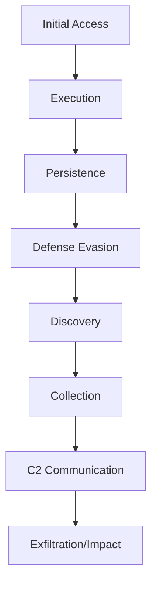

# Malware Analysis Template

> **Analysis Status:** 🔴 In Progress | 🟡 Under Review | 🟢 Complete  
> **Last Updated:** YYYY-MM-DD  
> **Analyst:** [Your Name]

## Executive Summary

**Malware Name:** [Name]  
**Alternate Names/Aliases:**  
- Alias 1
- Alias 2

**Malware Type:** Ransomware / RAT / Stealer / Loader / Backdoor / Banking Trojan / Exploit / Other  
**Threat Level:** 🔴 Critical | 🟡 High | 🟢 Medium | ⚪ Low

**First Seen:** YYYY-MM-DD  
**Last Activity:** YYYY-MM-DD  
**Current Status:** Active / Dormant / Historical

**Quick Description:**  
[2-3 sentence summary of the malware and its impact]

---

## Basic Information

### Classification
- **Family:** [Malware family name]
- **Variant:** [Specific variant if applicable]
- **Version:** [Version number if known]
- **Generation:** [Gen 1, 2, 3, etc.]

### Distribution Model
- [ ] Malware-as-a-Service (MaaS)
- [ ] Ransomware-as-a-Service (RaaS)
- [ ] Custom/APT Tool
- [ ] Open Source
- [ ] Commodity/Commercial

**Pricing (if MaaS/RaaS):**  
- Subscription: $XXX/month
- Revenue Share: XX%
- One-time: $XXX

---

## Attribution

**Associated Threat Actors:**
- [[APT-Group-1]] - Relationship
- [[Threat-Actor-2]] - Relationship

**Developer/Operator:**  
- Known developer: [Name/Handle]
- Underground handle: [Handle]
- Attribution confidence: High / Medium / Low

**Geographic Origin:**  
- Suspected origin: [Country/Region]
- Language indicators: [Languages found in code/strings]
- Timezone patterns: [UTC+X]

---

## Technical Analysis

### File Information

**Sample Hash (Primary Analysis):**
- MD5: `d41d8cd98f00b204e9800998ecf8427e`
- SHA1: `da39a3ee5e6b4b0d3255bfef95601890afd80709`
- SHA256: `e3b0c44298fc1c149afbf4c8996fb92427ae41e4649b934ca495991b7852b855`

**File Metadata:**
- File Name: `malware.exe`
- File Size: XXX KB / MB
- File Type: PE32 / ELF / Mach-O / Script / Document / Other
- Compile Time: YYYY-MM-DD HH:MM:SS
- Packer/Protector: UPX / Themida / VMProtect / None / Unknown

**VirusTotal Detection:**
- Detection Rate: XX/70
- First Submission: YYYY-MM-DD
- Last Analysis: YYYY-MM-DD
- VT Link: [URL]

### Supported Platforms
- [ ] Windows (x86 / x64 / ARM)
- [ ] Linux (x86 / x64 / ARM)
- [ ] macOS (Intel / Apple Silicon)
- [ ] Android
- [ ] iOS
- [ ] Cross-platform

**Minimum Requirements:**
- OS Version: [e.g., Windows 7+]
- Privileges: User / Admin / System
- Dependencies: .NET / Java / Python / None

---

## Capabilities & Features

### Primary Functions
1. **Function 1:** Description
2. **Function 2:** Description
3. **Function 3:** Description

### Detailed Capabilities

#### Data Theft
- [ ] Credentials (browsers, email, FTP)
- [ ] Cryptocurrency wallets
- [ ] Session tokens/cookies
- [ ] Credit card information
- [ ] Screenshots
- [ ] Keylogging
- [ ] Clipboard monitoring
- [ ] Form grabbing
- [ ] Webcam access
- [ ] Microphone access

#### Remote Control
- [ ] Remote shell access
- [ ] Remote desktop
- [ ] File management (upload/download)
- [ ] Process management
- [ ] Registry manipulation
- [ ] Service management

#### Propagation
- [ ] Network shares
- [ ] Removable drives
- [ ] Email spreading
- [ ] Exploit-based
- [ ] Supply chain

#### Persistence Mechanisms
- [ ] Registry run keys
- [ ] Scheduled tasks
- [ ] Windows services
- [ ] DLL hijacking
- [ ] Browser extensions
- [ ] Rootkit capabilities
- [ ] Bootkit capabilities

#### Defense Evasion
- [ ] Anti-VM detection
- [ ] Anti-sandbox
- [ ] Anti-debugging
- [ ] Code obfuscation
- [ ] Encryption
- [ ] Process injection
- [ ] Legitimate binary abuse (LOLBins)
- [ ] Disable security software

---

## Attack Chain

### Infection Vector

**Primary Distribution Methods:**
1. Phishing emails with malicious attachments
2. Drive-by downloads from compromised websites
3. Exploit kits
4. Software bundling
5. Supply chain compromise
6. Other: ___________

**Initial Access:**
```
[Describe the initial infection method in detail]
```

### Execution Flow



**Detailed Steps:**
1. **Stage 1:** Description
2. **Stage 2:** Description
3. **Stage 3:** Description
4. **Stage 4:** Description

---

## Command & Control (C2)

### C2 Architecture
**Type:** Centralized / P2P / Hybrid / Domain Generation Algorithm (DGA)

**Protocols:**
- [ ] HTTP/HTTPS
- [ ] DNS
- [ ] IRC
- [ ] Telegram
- [ ] Discord
- [ ] Custom protocol
- [ ] Tor
- [ ] Cloud services (specify): ___________

### C2 Communication

**Primary C2 Servers:**
- `192.168.1.1:443` - [[IOC-IP-1]] - Status: Active/Inactive
- `c2-domain.com` - [[IOC-Domain-1]] - Status: Active/Inactive

**Backup/Fallback C2:**
- [List backup C2 infrastructure]

**Communication Pattern:**
- Beacon interval: Every XX seconds/minutes
- Encryption: AES-256 / RSA / RC4 / XOR / None
- Authentication: [Method]
- User-Agent strings: [If HTTP/HTTPS]

**Network Signatures:**
```
[Unique patterns in network traffic]
```

### DGA (if applicable)
**Algorithm:** [Name]  
**Seed:** [Seed value or method]  
**Generated Domains Per Day:** [Number]

---

## MITRE ATT&CK Mapping

**Tactics & Techniques:**

| Tactic | Technique ID | Technique Name | Details |
|--------|--------------|----------------|---------|
| Initial Access | T1566.001 | Spearphishing Attachment | Email with malicious doc |
| Execution | T1059.003 | Windows Command Shell | Executes cmd.exe |
| Persistence | T1547.001 | Registry Run Keys | HKCU\Software\...\Run |
| Privilege Escalation | T1055 | Process Injection | Injects into explorer.exe |
| Defense Evasion | T1027 | Obfuscated Files | Base64 encoded strings |
| Credential Access | T1555.003 | Web Browsers | Steals saved passwords |
| Discovery | T1082 | System Information Discovery | Gathers OS info |
| Lateral Movement | T1021.001 | SMB/Windows Admin Shares | Spreads via network |
| Collection | T1056.001 | Keylogging | Captures keystrokes |
| C2 | T1071.001 | Web Protocols | HTTPS to C2 |
| Exfiltration | T1041 | C2 Channel | Data via C2 |
| Impact | T1486 | Data Encrypted for Impact | Ransomware encryption |

**MITRE ATT&CK Navigator Link:** [URL if available]

---

## Indicators of Compromise (IOCs)

### Network IOCs

**IP Addresses:**
```
192.168.1.1
10.0.0.1
```

**Domains:**
```
malicious-domain.com
c2-server.net
```

**URLs:**
```
http://example.com/payload.exe
https://c2-domain.com/api/checkin
```

### File IOCs

**Known File Hashes:**
```
MD5:    d41d8cd98f00b204e9800998ecf8427e
SHA1:   da39a3ee5e6b4b0d3255bfef95601890afd80709
SHA256: e3b0c44298fc1c149afbf4c8996fb92427ae41e4649b934ca495991b7852b855
```

**File Names:**
```
invoice.exe
document.pdf.exe
update.dll
```

**File Paths:**
```
C:\Users\%USERNAME%\AppData\Roaming\Microsoft\malware.exe
%TEMP%\installer.exe
```

### Registry IOCs
```
HKCU\Software\Microsoft\Windows\CurrentVersion\Run\Updater = "C:\path\to\malware.exe"
HKLM\Software\[malware_key]
```

### Mutex/Named Objects
```
Global\{unique-mutex-name}
malware_instance_mutex
```

### Service Names
```
MalwareService
WindowsUpdateService (fake)
```

---

## Behavioral Indicators

### Process Activity
- Spawns unusual child processes
- Injects into legitimate processes: explorer.exe, svchost.exe
- Creates/modifies services
- Unusual parent-child relationships

### File System Activity
- Creates files in: %APPDATA%, %TEMP%, %PROGRAMDATA%
- Modifies system files
- Deletes shadow copies (ransomware)
- Large file I/O operations

### Network Activity
- Beaconing to external IPs
- Unusual port usage: 8080, 4444, 1337
- High volume data exfiltration
- DNS queries to suspicious domains

### Registry Activity
- Modifies autorun locations
- Creates new registry keys under Software\
- Disables security settings

---

## Detection & Prevention

### Detection Rules

**Sigma Rule:**
```yaml
title: [Malware Name] Detection
id: [UUID]
status: stable
description: Detects [malware name] activity
references:
    - https://example.com/analysis
logsource:
    category: process_creation
    product: windows
detection:
    selection:
        CommandLine|contains:
            - 'suspicious_pattern'
        ParentImage|endswith:
            - '\powershell.exe'
    condition: selection
falsepositives:
    - Unlikely
level: high
tags:
    - attack.t1059
```

**YARA Rule:**
```yara
rule Malware_Family_Name {
    meta:
        description = "Detects [Malware Name]"
        author = "Your Name"
        date = "YYYY-MM-DD"
        hash = "SHA256"
        reference = "URL"
    strings:
        $s1 = "unique_string_1" ascii
        $s2 = {4D 5A 90 00 03 00}
        $s3 = /regex_pattern/
    condition:
        uint16(0) == 0x5A4D and 2 of ($s*)
}
```

**Snort/Suricata:**
```
alert tcp $HOME_NET any -> $EXTERNAL_NET any (msg:"[Malware Name] C2 Beacon"; \
  flow:established,to_server; content:"|unique_bytes|"; offset:0; depth:10; \
  classtype:trojan-activity; sid:1000001; rev:1;)
```

### EDR/SIEM Queries

**Splunk:**
```spl
index=endpoint (process_name="malware.exe" OR process_hash="SHA256")
| stats count by host, user, parent_process
```

**Elastic/KQL:**
```kql
process.name: "malware.exe" OR process.hash.sha256: "hash_value"
```

**Microsoft Defender ATP:**
```
DeviceProcessEvents
| where FileName == "malware.exe" or SHA256 == "hash_value"
| project Timestamp, DeviceName, AccountName, ProcessCommandLine
```

---

## Sandbox Analysis Results

### Any.Run
- **Link:** [URL]
- **Date:** YYYY-MM-DD
- **Key Findings:** [Summary]

### Hybrid Analysis
- **Link:** [URL]
- **Date:** YYYY-MM-DD
- **Key Findings:** [Summary]

### Joe Sandbox
- **Link:** [URL]
- **Date:** YYYY-MM-DD
- **Key Findings:** [Summary]

### Custom Sandbox
**Environment:** [OS and configuration]  
**Observations:**
- [Finding 1]
- [Finding 2]

---

## Mitigation & Remediation

### Prevention
1. **Email Security:**
   - Block file extensions: .exe, .scr, .com, .bat in emails
   - Implement SPF/DKIM/DMARC
   - User awareness training

2. **Endpoint Protection:**
   - Deploy EDR solution
   - Enable application whitelisting
   - Keep systems patched

3. **Network Security:**
   - Block C2 IPs/domains at firewall
   - Implement egress filtering
   - Monitor for beaconing behavior

### Detection
1. Monitor for IOCs listed above
2. Hunt for behavioral patterns
3. Deploy detection rules (Sigma/YARA/Snort)
4. Enable enhanced logging

### Remediation Steps
1. **Immediate:**
   - Isolate affected systems
   - Block C2 infrastructure
   - Collect forensic artifacts

2. **Short-term:**
   - Remove malware using AV/EDR
   - Reset credentials
   - Scan for lateral movement
   - Check for persistence mechanisms

3. **Long-term:**
   - Patch vulnerabilities
   - Implement hardening
   - Review security controls
   - Conduct post-incident review

---

## Decryption/Recovery (if ransomware)

**Ransom Note:**
```
[Paste ransom note content]
```

**Ransom Demand:** 
- Amount: $XXX USD / XXX BTC
- Payment deadline: XX hours/days
- Contact method: Email / Tor site / Other

**Encryption Details:**
- Algorithm: AES-256 / RSA-2048 / ChaCha20 / Other
- File extensions: .locked, .encrypted, .malware_ext
- Affected file types: All / Documents / Databases / Specific

**Decryption Status:**
- [ ] No decryptor available
- [ ] Decryptor available (link): [URL]
- [ ] Recoverable via other means

**Recovery Resources:**
- No More Ransom Project: [URL]
- Vendor decryption tool: [URL]
- Other: [URL]

---

## Related Entities

**Related Malware:**
- [[Malware-Family-1]] - Predecessor/successor
- [[Malware-Family-2]] - Code sharing

**Associated APT Groups:**
- [[APT-Group-1]]
- [[Threat-Actor-2]]

**Related Campaigns:**
- [[Campaign-1]]
- [[Campaign-2]]

---

## Intelligence Sources & References

### Primary Analysis Reports
1. [Title] - [Source] - [Date] - [URL]
2. [Title] - [Source] - [Date] - [URL]

### Vendor Writeups
- [Vendor 1]: [URL]
- [Vendor 2]: [URL]

### Community Research
- [Researcher/Blog]: [URL]
- Twitter thread: [URL]

### Samples
- MalwareBazaar: [URL]
- VirusBay: [URL]
- GitHub (if open source): [URL]

---

## Timeline

| Date | Event | Source |
|------|-------|--------|
| YYYY-MM-DD | First observed | Link |
| YYYY-MM-DD | Major update/version | Link |
| YYYY-MM-DD | Used in campaign | Link |
| YYYY-MM-DD | Decryptor released | Link |

---

## Analysis Notes

### Static Analysis Notes
```
[Key findings from static analysis]
```

### Dynamic Analysis Notes
```
[Key findings from dynamic analysis/sandbox]
```

### Code Analysis
```
[Interesting code snippets or algorithms]
```

### Evolution
[How the malware has evolved over time]

### Knowledge Gaps
- [ ] Unknown C2 protocol details
- [ ] Missing encryption keys
- [ ] Unidentified capabilities
- [ ] Other: ___________

---

## Metadata

**Tags:**  
`#malware` `#ransomware` or `#rat` or `#stealer` etc. `#active` `#platform/windows` `#high-priority`

**Analysis Type:** Static / Dynamic / Hybrid  
**Lab Environment:** [Environment details]  
**Analyst:** [Your name]  
**Analysis Date:** YYYY-MM-DD  
**Review Date:** YYYY-MM-DD  

**Classification:** TLP:WHITE / TLP:GREEN / TLP:AMBER / TLP:RED  
**Sharing:** Public / Community / Internal

---

## Quick Links
- [[Malware-Index]] - Return to Malware Index
- [[APT-Index]] - Related threat actors
- [[IOC-Dashboard]] - Extract IOCs
- [[Campaign-Index]] - Related campaigns